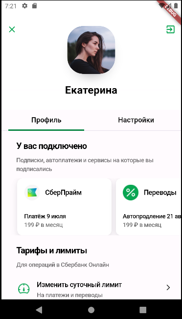
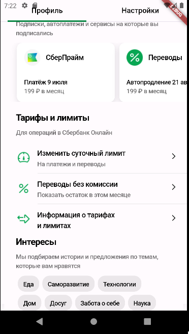

# Digital_Department_Flutter

## Описание проекта
Это проект экрана приложения, написанный на Flutter c использованием Dart. На экране присутствуют следующие элементы:

- **Кнопки выхода**: Кнопки выхода из приложения
- **Аватар**: Аватар пользователя.
- **Имя**: Имя пользователя.
- **Кнопки навигации**: Кнопки для навигации по приложению.
- **Заголовок для карточек**: Заголовок для карточек приложения.
- **Карточки**: Карточки приложения.
- **Заголовок операций**: Заголовок для кнопок операций.
- **Кнопки операций**: Кнопки операций сбера.
- **Заголовок интересов**: Заголовок для кнопок интересов.
- **Кнопки интересов**: Кнопки интересов пользователя.

## Структура проекта
- **`main`**: Главный файл для компиляции всего приложения.
- **`card`**:  Карточки приложения..
- **`disclosure`**: Кнопки операций сбера.
- **`fill`**: Кнопки интересов пользователя.
- **`navigationbuttons`**: Кнопки для навигации по приложению.
- **`sectionheader`**: Заголовоки приложения.
- **`appbar`**: Кнопки выхода из приложения
- **`avatar`**: Аватар пользователя.
- **`name`**: Имя пользователя.

## Технологии
- Flutter, Dart

## Как использовать
1. Клонируйте репозиторий.
2. Откройте проект в вашей IDE. Желательно в AndroidStudio.
3. Запустите проект и убедитесь, что у вас установлены все необходимые зависимости.

На момент написания
Версия flutter: 3.16.1
Версия Dart: 3.2.1
Работал в Android Studio, версия: BumbleBee | 2021.1.1 Patch 3
Проверял на телефоне: Pixel 2 API 30

## Автор
Автор: Раевских Максим Игоревич